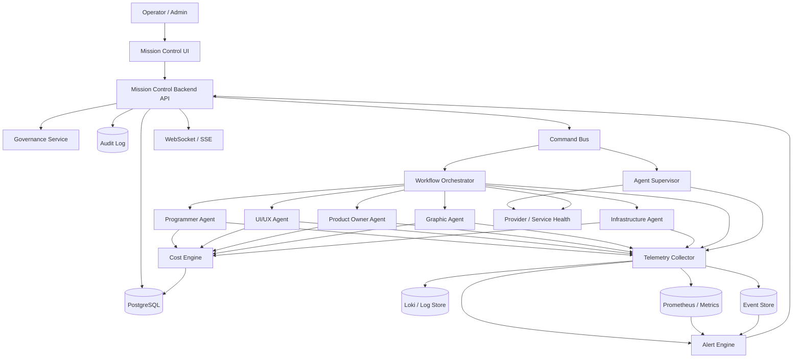

# MISSION_CONTROL_ARCHITECTURE.md

## Formål
Beskrive en production-ready arkitektur for Mission Control Center til OpenClaw.

---

## 1. Arkitektur i lag

### Lag 1 — Agent Runtime Layer
Her kører de operative agenter:
- Programmer
- UI/UX
- Product Owner
- Graphic Designer
- Infrastructure

Disse agenter udfører tasks, kalder LLM/APIs, genererer logs/events/metrics og rapporterer heartbeats.

### Lag 2 — Orchestration Layer
Ansvarlig for:
- task queue
- workflow state machine
- dependencies
- retries/backoff
- scheduling
- assignment til agenter

### Lag 3 — Telemetry Layer
Ansvarlig for:
- structured logs
- metrics
- event stream
- correlation IDs
- traces/spans via OpenTelemetry

### Lag 4 — Control Plane Layer
Ansvarlig for:
- operational API
- authorization
- command dispatch
- audit logging
- state aggregation

### Lag 5 — Mission Control UI
Ansvarlig for:
- overview
- agent/task/workflow views
- observability surfaces
- incident handling
- command execution

### Lag 6 — Persistence Layer
Ansvarlig for:
- operational state
- historik
- logs
- metrics
- audit trails
- cost records

---

## 2. Centrale services

### Agent Supervisor Service
- registrerer agenter
- holder heartbeat-status
- markerer stuck/dead agents
- udfører start/stop/restart via command pipeline

### Workflow Orchestrator
- opretter og kører workflows
- håndterer task dependencies
- styrer retries og transitions
- eksponerer workflow/task state

### Telemetry Collector
- modtager metrics/logs/events
- normaliserer data
- sørger for korrelation mellem workflow/task/agent

### Cost Engine
- beregner token usage og cost
- aggregerer spend per agent/workflow/provider/model
- trigger cost-spike signaler

### Alert Engine
- evaluerer thresholds og anomalier
- deduper og grupperer alerts
- sender incidents videre til UI og evt. integrationskanaler

### Governance Service
- RBAC
- audit logs
- command policy checks
- API key inventory

### Mission Control Backend API
- samler data til frontend
- eksponerer query- og command-endpoints
- leverer live updates via WebSocket/SSE

---

## 3. Foreslået teknologistak

### Frontend
- Next.js
- React
- TanStack Table
- charting library til metrics/costs
- WebSocket/SSE klient til live updates

### Backend
- TypeScript
- Fastify eller NestJS
- OpenTelemetry SDK

### Data og messaging
- PostgreSQL til operationelle data
- Redis eller NATS til command/event transport
- objektstorage senere til længere retention af artefakter

### Observability
- OpenTelemetry Collector
- Prometheus
- Loki
- Grafana som supplerende intern observability toolchain

### Deployment
- Docker til første release
- Kubernetes når agentantal og workloads stiger

---

## 4. Logisk dataflow

1. En workflow request oprettes
2. Workflow Orchestrator splitter arbejdet i tasks
3. Tasks assignes til relevante agenter
4. Agenter emitter heartbeats, logs, events og cost metadata
5. Telemetry Collector og Cost Engine aggregerer signaler
6. Control Plane API samler state til Mission Control UI
7. Operatør kan udstede kommandoer
8. Kommandoer går gennem RBAC, audit og async dispatch
9. Resultater sendes tilbage som events og state updates

---

## 5. Realtime model
Mission Control skal bruge en kombination af:
- pull til historiske og tunge queries
- push via WebSocket/SSE til live status, events og alerts

Push bruges til:
- agent state changes
- task state changes
- nye alerts
- command status updates
- cost spike events

---

## 6. Command pipeline

Alle kommandoer skal følge denne kæde:
1. UI action
2. authn/authz check
3. policy check
4. auditlog oprettes
5. command lægges på command bus
6. executor udfører handling
7. result-event skrives
8. UI opdateres

Dette beskytter mod direkte uautoriserede runtime-kald.

---

## 7. Mermaid-diagram

---

## 8. Dashboard informationsarkitektur

### Overview
- global status
- open alerts
- running workflows
- active agents
- cost/hour
- infra health summary

### Agents
- liste over alle agenter
- state, heartbeat, current task, cost, success rate
- controls: restart, stop, inspect

### Tasks
- pending/running/completed/failed
- prioritet, dependencies, retries, assigned agent

### Workflows
- workflow status
- dependency view
- timeline og state transitions
- rerun/pause/resume

### Observability
- metrics
- logs
- events
- trace/correlation lookup

### Costs
- spend by agent/workflow/provider/model
- token trends
- burn rate

### Infrastructure
- CPU/RAM/disk
- container/service health
- DB/queue/provider health

### Alerts
- active incidents
- severity
- status
- acknowledge/resolve
- runbook links

### Security/Governance
- audit logs
- RBAC view
- API key inventory
- sensitive command history

---

## 9. Nøglekontrakter

### Telemetry contract
Alle agenter og services skal mindst sende:
- timestamp
- agentId/service
- workflowId/taskId hvor relevant
- eventType
- severity
- status/resultat
- latency
- token usage hvis LLM-kald
- error metadata hvis fejl

### State contract
State transitions skal være autoritative og konsistente mellem:
- Agent Supervisor
- Workflow Orchestrator
- Mission Control UI

### Cost contract
Alle LLM-kald og provider-kald skal kunne føres tilbage til:
- agent
- task
- workflow
- model/provider

---

## 10. Production-risici og modtræk

### Risiko: blind spots
**Modtræk:** fælles telemetry SDK og schema validation.

### Risiko: runaway retries og costs
**Modtræk:** retry caps, circuit breakers, cost guardrails.

### Risiko: control plane outage
**Modtræk:** stateless API, separate command bus, health checks, replicated instances.

### Risiko: state mismatch
**Modtræk:** heartbeat TTL + reconciliation loop.

### Risiko: alert fatigue
**Modtræk:** dedupe, grouping, severity policy.

---

## 11. Anbefalet næste tekniske skridt
1. Fastlæg endeligt DB schema
2. Definér API endpoints for v1
3. Beskriv event schemas og command schemas
4. Lav wireframes for Mission Control UI
5. Bryd backend op i implementerbare work packages
